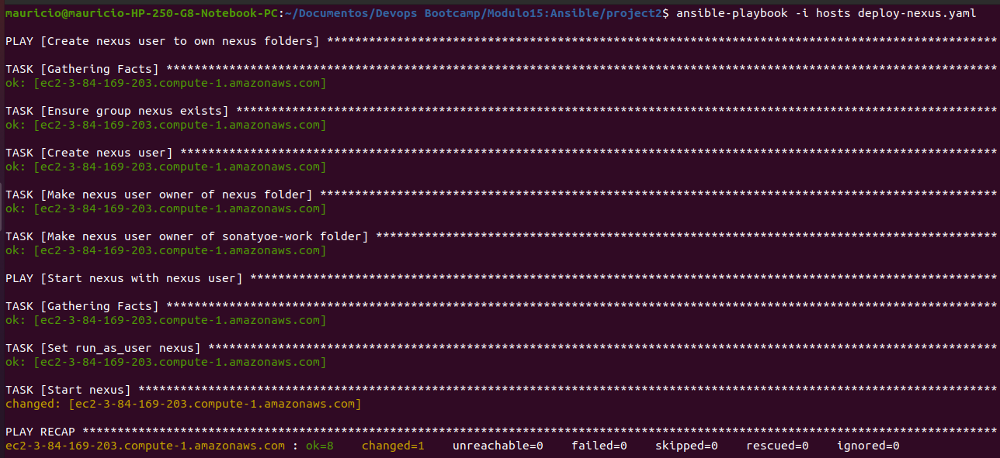

# Demo Project 1

Automate Node.js application Deployment

## Technologies Used

Ansible, Node.js, DigitalOcean, Linux

## Project Description

- Create Server on DigitalOcean
- Write Ansible Playbook that installs necessary technologies, creates Linux user for an application and
deploys a NodeJS application with that user

### Details of project   

Project files: project1 folder

- Create droplet and configure hosts

  In this step a new server were created in the cloud (I used AWS EC2 instance) and the hosts file were configured to access this server.

- Playbook Configuration

    The first play consists of the following code:

  ```sh
    - name: Install Node.js and npm
    hosts: webserver
    become: yes  
    tasks:  
        - name: Update apt repo and cache
        apt: 
            update_cache=yes 
            force_apt_get=yes 
            cache_valid_time=3600
        - name: Install Node.js and npm
        apt: 
            pkg:
            - nodejs
            - npm 
  ```
    Since the project is running on an Ubuntu EC2 instance without root access, I had to add become: yes to gain superuser privileges and execute apt commands.

    Explanation of the options:

    update_cache=yes: Updates the list of available packages (similar to apt-get update).
    force_apt_get=yes: Forces the use of apt-get instead of apt.
    cache_valid_time=3600: Specifies that the package cache is valid for 3600 seconds (1 hour), avoiding unnecessary updates.
    The second play is responsible for copying the tar file and unpacking it.

    The application consists of a simple server.js file and a Dockerfile. Running npm pack compresses the Dockerfile, README.md, package.json, and the app folder (which contains the application) into a .tgz file. When unpacked, these files are placed inside a package folder, which will be transferred to the server.

    The play for deploying the app is as follows:

  ```sh
    - name: Deploy Node.js App
    hosts: webserver
    tasks: 
        - name: Copy Node.js folder to the server
        copy: 
            src: 
            dest: /home/ubuntu/app-1.0.0.tgz  # Change to root later if needed
        - name: Unpack the Node.js file
        unarchive:
            src: /home/ubuntu/app-1.0.0.tgz
            dest: /home/ubuntu/
            remote_src: yes  # Indicates that the source is already on the remote server 
  ```
    To run the Ansible playbook, use the following command:

  ```sh
    ansible-playbook -i hosts deploy-node.yaml
  ```
  

- Alternative Method

  It is also possible to execute the second play with a single task, directly unpacking the .tgz file from the local machine to the cloud server, eliminating the need for remote_src:

  ```sh
    - name: Deploy Node.js App
    hosts: webserver
    tasks: 
        - name: Unpack the Node.js file
        unarchive:
            src: /home/mauricio/Documents/nodejs-app/nodejs-app-1.0.0.tgz
            dest: /home/ubuntu/
  ```

- Running the Application

  After testing this part of the code, the play was extended with two additional tasks to install dependencies and start the application:

  ```sh
    - name: Install dependencies
      npm:
        path: /home/ubuntu/package
    - name: Start the application
      command: 
        chdir: /home/ubuntu/package/app
        cmd: node server
  ```
  

  This way, Node.js runs successfully, but Ansible will not finish executing because the command will keep running. To resolve this, the process should be run in the background using async and poll.

  The application is running successfully, but an improvement will be implemented to display the result directly in the terminal, eliminating the need to SSH into the machine to check the process.

- Improving Security: Creating a Non-Root User

  All actions were initially performed using the root user, which is not very secure. To improve security, a new user was created on the server, and actions were executed inside this user's home directory.

  ```sh
    - name: Create new Linux user for Node.js app
    hosts: webserver
    become: yes  # Use root user to create the new user
    tasks:
        - name: Create Linux user
        user:
            name: mauricio
            comment: Mauricio Admin
            group: admin  
  ```
  

  By using a dedicated user instead of root, the security of the deployment process is significantly improved.

# Demo Project 2

Automate Nexus Deployment

## Technologies Used

Ansible, Nexus, DigitalOcean, Java, Linux

## Project Description

- Create Server on DigitalOcean
- Write Ansible Playbook that creates Linux user for Nexus, configure server, installs and deploys Nexus and verifies that it is running successfully

### Details of project   

Project files: project2 folder

- Create droplet and configure hosts  

  As explained in project 1, I user an ec2 server to do this project.

- Playbook Configuration: First Play (Install Java)

  This play is configured to execute the following three commands:

  ```sh
    apt-get update
    apt install openjdk-8-jre-headless
    apt install net-tools
  ```

  The installation of these tools is done using the apt module in Ansible, with each command passed inside a name.

- Playbook Code:

  ```sh
   - name: Install Java and net-tools
    hosts: webserver
    become: yes  # Gain superuser privileges to run apt commands
    tasks:
        - name: Update apt cache
        apt: 
            update_cache=yes
        - name: Install Java 8
        apt: 
            name=openjdk-8-jre-headless
        - name: Install net-tools
        apt: 
            name=net-tools
  ```
  become: yes: Elevates privileges to run commands requiring superuser access.
  update_cache=yes: Updates the list of available packages to ensure the latest versions are installed.
  Second Play: Download and Untar Nexus File

  Commands to Execute Manually:

  ```sh
    cd /opt
    wget https://download.sonatype.com/nexus/3/latest-unix.tar.gz
    tar -zxvf latest-unix.tar.gz
  ```
  The tutorial approach wasn’t working, so I used the command module to achieve the same effect. The downloaded file was renamed to a consistent name to avoid having to check the version-specific filename manually.

- Playbook Code:

  ```sh
    - name: Download and Install Nexus
        hosts: webserver
        become: yes  
        tasks:
            - name: Download Nexus
            command: >
                wget https://download.sonatype.com/nexus/3/latest-unix.tar.gz
                -O /opt/nexus-latest.tar.gz
            args:
                creates: /opt/nexus-latest.tar.gz  # Prevents downloading if the file exists

            - name: Untar Nexus installer
            unarchive:
                src: /opt/nexus-latest.tar.gz
                dest: /opt/
                remote_src: yes  # Specifies that the source is on the remote server
  ```
  creates: Prevents re-downloading if the file already exists.
  remote_src: yes: Indicates that the file is already on the remote server.
  Renaming the Folder Dynamically

  In the Nexus module, the untarred folder is not renamed, which can cause issues if the version changes. To handle this dynamically, I used the find command to locate the folder containing nexus- and rename it.

- Playbook Code for Renaming:

  ```sh
    - name: Rename Nexus Folder
    hosts: webserver
    become: yes
    tasks:
        - name: Find untarred Nexus folder
        command: find /opt -maxdepth 1 -type d -name "nexus-*"
        register: nexus_folder

        - name: Rename Nexus folder to /opt/nexus
        command: mv {{ nexus_folder.stdout }} /opt/nexus
        when: nexus_folder.stdout != "/opt/nexus"
  ```
  find command:Finds the folder starting with nexus- under /opt without diving into subdirectories.
  register: Captures the output (folder name) to use in the next task.
  when: Ensures renaming only happens if the folder isn’t already named /opt/nexus.
    
- Running the Ansible Playbook

  To execute the playbook, use the command:

  ```sh
    ansible-playbook -i hosts deploy-nexus.yaml
  ```

  

  This command will:
    - Install Java and net-tools.
    - Download and extract Nexus.
    - Rename the Nexus folder dynamically.
    
- Create Nexus User and Set Permissions

  Manual Commands:    

  ```sh
    adduser nexus
    chown -R nexus:nexus nexus-3.65.0-02
    chown -R nexus:nexus sonatype-work
  ```
  Playbook Code:

  ```sh
    - name: Create nexus user and set permissions
    hosts: webserver
    become: yes  
    tasks:
        - name: Ensure nexus group exists
        group: 
            name: nexus
            state: present

        - name: Create nexus user
        user: 
            name: nexus
            group: nexus

        - name: Set nexus user as owner of nexus folder
        file: 
            path: /opt/nexus
            state: directory
            owner: nexus
            group: nexus
            recurse: yes

        - name: Set nexus user as owner of sonatype-work folder
        file: 
            path: /opt/sonatype-work
            state: directory
            owner: nexus
            group: nexus
            recurse: yes

        - name: Copy SSH keys to nexus user
        command: cp /home/ubuntu/.ssh/authorized_keys /home/nexus/.ssh/authorized_keys
  ```
  This playbook will:
  - Creates a nexus group if it doesn’t exist.
  - Creates a nexus user under the nexus group.
  - Changes ownership of Nexus and Sonatype folders recursively to nexus.
  - Copies SSH keys to the nexus user for secure access.

- Edit nexus.rc and Run Nexus as nexus User

  Manual Commands:

  ```sh
    vim nexus-3.65.0-02/bin/nexus.rc
    Add: run_as_user="nexus"
    su - nexus
    /opt/nexus-3.65.0-02/bin/nexus start
    sudo cp /home/ubuntu/.ssh/authorized_keys /home/nexus/.ssh/authorized_keys
  ```
- Playbook Code

  ```sh
    - name: Run Nexus with nexus user
    hosts: webserver
    become: yes
    tasks:
        - name: Set run_as_user nexus in nexus.rc
        blockinfile:
            path: /opt/nexus/bin/nexus.rc
            block: | 
            run_as_user="nexus"

        - name: Ensure correct permissions for nexus.rc
        file:
            path: /opt/nexus/bin/nexus.rc
            owner: nexus
            group: nexus
            mode: '0644'

        - name: Start Nexus as nexus user
        become_user: nexus
        command: /opt/nexus/bin/nexus start
  ```
  This playbook will:

  - Edits nexus.rc to set run_as_user="nexus".
  - Ensures correct permissions for nexus.rc.
  - Starts Nexus as the nexus user.

- Verify if Nexus is Running

  Manual Commands:

  ```sh
    ps aux | grep nexus
    netstat -lnpt
  ```
- Playbook Code:

  ```sh
    - name: Verify Nexus is running
    hosts: webserver
    become: yes
    tasks:
        - name: Check Nexus process
        shell: ps aux | grep nexus | grep -v grep
        register: nexus_process
        changed_when: false

        - name: Display Nexus process status
        debug:
            msg: "{{ nexus_process.stdout }}"

        - name: Check if Nexus port is open (default 8081)
        shell: netstat -lnpt | grep 8081
        register: nexus_port
        changed_when: false

        - name: Display Nexus port status
        debug:
            msg: "{{ nexus_port.stdout }}"
  ```
  This playbook will:
  - Uses ps aux to check if Nexus is running.
  - Checks if the default Nexus port (8081) is open.
  - Displays results with debug.

- Running the Full Playbook

To execute all plays, use:

  ```sh
    ansible-playbook -i hosts deploy-nexus.yaml
  ```
  


# Demo Project 3

Ansible & Docker

## Technologies Used

Ansible, AWS, Docker, Terraform, Linux

## Project Description

- Create AWS EC2 Instance with Terraform
- Write Ansible Playbook that installs necessary technologies like Docker and Docker Compose, copies
docker-compose file to the server and starts the Docker containers configured inside the docker-
compose file

### Details of project   

Project files: project3 folder

- Create an Amazon Linux instance using Terraform

  The Terraform scripts created in the Terraform module was used to launch an Amazon Linux instance, and updated the Ansible inventory to connect to it:

  ```sh
    <aws ec2 public IP> ansible_ssh_private_key_file=~/.ssh/id_rsa ansible_user=ec2-user
  ```

- Install Docker and Docker Compose

  To work with Amazon Linux, we will use the yum package manager to install Docker.

  The suggested approach in the lessons was:

  ```sh
    tasks:
    - name: Install Docker
        yum:
        name: docker
        update_cache: yes
        state: present
  ```
- Issue: Python Interpreter Error
  I encountered an error trying to run this playbook: No such file or directory: '/usr/bin/python'
  I couldn’t resolve it to use Python 3 instead of Python on the server, so I installed Docker in a different way:

  ```sh
    tasks:
    - name: Install Docker
        shell: |
        sudo yum update -y
        sudo yum install -y docker
        sudo systemctl start docker
        sudo systemctl enable docker  
  ```

- Copy Docker Compose File

  Docker Compose cannot be installed via yum, so it will be installed using CLI plugins:

  ```sh
    - name: Install Docker-compose
    hosts: dockerserver
    tasks:
        - name: Create docker-compose directory
        file:
            path: ~/.docker/cli-plugins
            state: directory

        - name: Get architecture of remote machine
        shell: uname -m
        register: remote_arch

        - name: Install docker-compose
        get_url: 
            url: "https://github.com/docker/compose/releases/latest/download/docker-compose-linux-{{ remote_arch.stdout }}"
            dest: ~/.docker/cli-plugins/docker-compose
            mode: +x  
  ```
  Task Breakdown:

    - Create Directory: Creates a directory at ~/.docker/cli-plugins to install Docker Compose.

    - Get System Architecture: Executes uname -m to fetch the system architecture and stores it in remote_arch.

    - Install Docker Compose: Downloads the appropriate Docker Compose binary based on system architecture and grants execute permissions.

- Start Docker Daemon

  Docker needs to be started to run commands like docker pull:

  ```sh
    - name: Start Docker
    hosts: dockerserver
    become: yes  
    tasks:
        - name: Start docker daemon
        systemd:
            name: docker
            state: started  
  ```

- Allow ec2-user to Run Docker Commands

  By default, only the root user can execute Docker commands. To enable ec2-user to use Docker:

  ```sh
    - name: Start Docker
    hosts: dockerserver
    become: yes  
    tasks:
        - name: Start docker daemon
        systemd:
            name: docker
            state: started

        - name: Reconnect to server session
        meta: reset_connection
  ```
Note: The server must be restarted for the group change to take effect.

-  Using Docker Community

  To test an application, like Redis, it was used:

  ```sh
    - name: Test docker pull
    hosts: dockerserver
    tasks:
        - name: Pull redis
        docker_image:
            name: redis
            source: pull  
  ```

- Move Docker Compose Files to Server

  ```sh
    - name: Start docker containers
    hosts: dockerserver
    vars_files:
        - project-vars
    tasks:
        - name: Copy docker compose
        copy:
            src: /home/mauricio/Documentos/docker-compose.yaml
            dest: /home/ec2-user/docker-compose.yaml
  ```

- Docker Login and Run Compose

  After copying the file, perform a Docker login because the Docker Compose file contains an image stored in Docker Hub.

  ```sh
    - name: Docker login
    docker_login: 
        username: mauriciocamilo
        password: "{{docker_password}}"

    - name: Start containers from compose
    community.docker.docker_compose_v2: 
        project_src: /home/ec2-user
        state: present # Runs docker compose up by default
  ```

  

- Refactoring Suggestions:

    The playbook is currently optimized for Amazon Linux due to the use of yum. For better reusability, consider these refactoring steps:

    Create a new user and add them to admin and docker groups.
    Run Docker Compose installation using the new user.
    Parameterize the YAML file to use the new user's name.

# Demo Project 4

Ansible Integration in Terraform

## Technologies Used

Ansible, Terraform, AWS, Docker, Linux

## Project Description

- Create Ansible Playbook for Terraform integration
- Adjust Terraform configuration to execute Ansible Playbook automatically, so once Terraform provisions a server, it executes an Ansible playbook that configures the server

### Details of project   

Project files: project4 folder

- Run the Ansible playbook via Terraform

  In this section, a provisioner was configured during the creation of the EC2 instance to execute the command that runs the playbook once the instance is up and running.

  ```sh
    provisioner "local-exec" { # Command executed on my machine
    working_dir = "/home/mauricio/Documentos/Devops_Bootcamp/Modulo15:Ansible/project3"
    command = "ansible-playbook --inventory ${self.public_ip}, --private-key ${ssh_key_private} --user ec2-user deploy-docker-ec2-user.yaml"
    }
  ```

  The --inventory flag is used to pass the public IP of the created instance so that Ansible can run on that machine. The private key and user are also provided to establish the connection.

- Updating the Playbook

  The playbook was initially configured to use the server specified in the hosts file. However, since this file is no longer in use, the value was changed to all to accept any host.

  When you run terraform apply, the Ansible commands are executed within the Terraform execution process.

  While this works, using a provisioner can cause timing issues—meaning the Ansible commands might execute before the instance is fully up, causing the playbook to fail. This can be resolved by adding a task to the playbook to wait for SSH to be ready:

  ```sh
    - name: Wait for SSH connection
    hosts: all
    gather_facts: false
    vars:
        ansible_connection: local # Runs locally
        ansible_python_interpreter: /usr/bin/python3 # Python interpreter version
    tasks:
        - name: Ensure SSH port is open
        wait_for:
            port: 22
            delay: 10
            timeout: 100
            search_regex: OpenSSH # Looks for this value on the port
            host: '{{ (ansible_ssh_host|default(ansible_host))|default(inventory_hostname) }}' # Dynamically determines host address
  ```

- Using Null Resource for Provisioning

  Another way to execute the provisioner is by using a null_resource, which is designed to run providers and depends on the creation of the EC2 instance. This approach eliminates the need for self.

  ```sh
    resource "null_resource" "configure_server" {
    depends_on = [aws_instance.myapp-server]

    provisioner "local-exec" {
        working_dir = "/home/mauricio/Documentos/Devops_Bootcamp/Modulo15:Ansible/project3"
        command     = "ansible-playbook --inventory ${aws_instance.myapp-server.public_ip}, --private-key ${var.ssh_key_private} --user ec2-user deploy-docker-ec2-user.yaml"
        }
    }
  ```
  To enable this, it is also needed to configure it in the providers:

  ```sh
    null = {
    source  = "hashicorp/null"
    version = "~> 3.0"
    }
  ```
  

  As shown in the Terraform execution logs, right after creating the resources, Ansible waits until the instance's IP is available before starting the playbook tasks, ensuring a smooth automation process.

# Demo Project 5

Configure Dynamic Inventory

## Technologies Used

Ansible, Terraform, AWS

## Project Description

- Create EC2 Instance with Terraform
- Write Ansible AWS EC2 Plugin to dynamically sets inventory of EC2 servers that Ansible should manage,
instead of hard-coding server addresses in Ansible inventory file

### Details of project   

Project files: project5 folder

- Create 3 Servers on AWS

  The same approach from previous projects was used to create the instances.

  To set up a dynamic inventory, Ansible must connect to AWS to fetch server information.

  There are two ways to do this: dynamic inventory plugins and scripts. The Ansible documentation suggests using plugins as they leverage Ansible's features and are written in YAML.

- AWS EC2 Plugin

  Using this plugin requires the installation of three libraries (python, boto3, and botocore), which were already installed locally in previous modules.

- Update ansible.cfg

  Add the following line to enable the AWS EC2 plugin:

  ```sh
    enable_plugins = aws_ec2
  ```
- Inventory File

  To create the inventory YAML file, it must specify the plugin name to be used. The minimal configuration for this file is shown below:

  ```sh
    plugin: aws_ec2
    regions:
    - us-east-1  
  ```

  To perform an initial test, the following command was run:

  ```sh
    ansible-inventory -i inventory_aws_ec2.yaml --list
  ```

  This command returned all attributes of the AWS instances in the specified region. Among these attributes was the private DNS name of the instances. To list only the DNS names, the --graph flag was used.

- Assign Public DNS to EC2 Instances

  It is not possible to connect to these instances using their private DNS unless the connection is made from within the VPC. Since the connection will be made locally, the public DNS must be used.

  To enable this, the Terraform script was modified to include this attribute for the created instances:

  ```sh
    resource "aws_vpc" "myapp-vpc" {
    enable_dns_hostnames = true # Added line to the VPC
    }  
  ```
- Configure Ansible to Use Dynamic Inventory

  In the playbook's hosts attribute, the value was changed to aws_ec2 so that Ansible knows to use this plugin, which has already been validated.

  Then, the playbook was run using the new inventory:

  ```sh
    ansible-playbook -i inventory_aws_ec2.yaml deploy-docker.yaml
  ```

  

  It can be seen that the playbook runn in the 3 servers.

- Configure ansible.cfg

  The ansible.cfg file was also configured to use the correct user and private key for SSH connections. Additionally, the inventory path was added to the configuration file to avoid needing to specify the -i flag in every command:

  ```sh
    [defaults]
    host_key_checking = false
    inventory = inventory_aws_ec2.yaml

    enable_plugins = aws_ec2

    remote_user = ec2-user
    private_key_file = ~/.ssh/id_rsa
  ```

- Target Only Specific Servers

  There may be situations where you don’t want to run the playbook on all instances. This can be done by setting filters in the inventory. For this project, two instances were tagged as dev-server and two as prod. A filter was configured to return only the dev instances:

  ```sh
    filters:
    tag:Name: dev*
    - Create Dynamic Groups  
  ```
  It is possible to configure the inventory to group servers based on a desired parameter. In this example, the servers were grouped by tag name, which should return 2 servers under the dev tag and 2 under the prod tag.

  ```sh
    keyed_groups:
    - key: tags
  ```
  

This configuration allows you to use the group names directly in the playbook's hosts attribute, making it easier to run tasks only on the desired groups.

# Demo Project 6

Automate Kubernetes Deployment

## Technologies Used

Ansible, Terraform, Kubernetes, AWS EKS, Python, Linux

## Project Description

- Create EKS cluster with Terraform
- Write Ansible Play to deploy application in a new K8s namespace

### Details of project   

Project files: project6 folder

- Create EKS Cluster with Terraform

  In this module, a Kubernetes (EKS) cluster was created using a Terraform script that was previously used in the last module.

- Create Namespace in EKS Cluster

  To interact with the created cluster, the kubeconfig file was generated using the following command:

  ```sh
    aws eks update-kubeconfig --region us-east-1 --name myapp-eks-cluster --kubeconfig /path-to-file/kubeconfig_myapp-eks-cluster
  ```
  This command updates the kubeconfig file to allow kubectl and Ansible to communicate with the EKS cluster.

- Creating the Playbook

  At this stage, a task was created to add a new namespace to the cluster using the previously configured kubeconfig file.

  ```sh
    - name: Deploy app in new namespace
    hosts: localhost
    tasks:
        - name: Create a k8s namespace
        kubernetes.core.k8s:
            name: my-app
            api_version: v1
            kind: Namespace
            state: present
            kubeconfig: /home/mauricio/Documentos/kubeconfig_myapp-eks-cluster
  ```
- Python Module Requirements

  To run Kubernetes modules with Ansible, the following Python libraries must be installed locally:

    - Kubernetes >= 12.0.0
    - PyYAML >= 3.11
    - jsonpatch

  These libraries enable Ansible to interact with the Kubernetes API.

- Verifying Namespace Creation

  After executing the playbook, the namespace was successfully created and verified using:

  ```sh
    kubectl get namespaces
  ```
- Deploy App in New Namespace

  The next step was to create a simple NGINX deployment in the newly created namespace using Ansible.

  ```sh
    - name: Deploy nginx app
    kubernetes.core.k8s:
        src: /home/mauricio/Documentos/k8s-nginx.yaml
        state: present
        kubeconfig: /home/mauricio/Documentos/kubeconfig_myapp-eks-cluster
        namespace: my-app  
  ```

  This task deploys NGINX to the my-app namespace in the EKS cluster.

- Verifying the Deployment

  After running the playbook successfully, the following command was used to get the service URL:

  ```sh
    kubectl get svc -n my-app
  ```
The service URL can be accessed in the browser to confirm that NGINX is running correctly.

- Simplifying Kubeconfig Management

To simplify the playbook, the kubeconfig path can be exported as an environment variable:

  ```sh
    export K8S_AUTH_KUBECONFIG=/home/mauricio/Documentos/kubeconfig_myapp-eks-cluster
  ```
This way, the playbook doesn’t need to explicitly define the kubeconfig path, making the code cleaner and more maintainable.

# Demo Project 7

Ansible Integration in Jenkins

## Technologies Used

Ansible, Jenkins, DigitalOcean, AWS, Boto3, Docker, Java, Maven, Linux, Git

## Project Description

- Create and configure a dedicated server for Jenkins
- Create and configure a dedicated server for Ansible Control Node
- Write Ansible Playbook, which configures 2 EC2 Instances
- Add ssh key file credentials in Jenkins for Ansible Control Node server and Ansible Managed Node servers
- Configure Jenkins to execute the Ansible Playbook on remote Ansible Control Node server as
part of the CI/CD pipeline
- So the Jenkinsfile configuration will do the following:
    a. Connect to the remote Ansible Control Node server
    b. Copy Ansible playbook and configuration files to the remote Ansible Control Node server
    c. Copy the ssh keys for the Ansible Managed Node servers to the Ansible Control Node server
    d. Install Ansible, Python3 and Boto3 on the Ansible Control Node server
    e. With everything installed and copied to the remote Ansible Control Node server, execute the
    playbook remotely on that Control Node that will configure the 2 EC2 Managed Nodes

### Details of project   

Project files: https://github.com/Mauricio-Camilo/java-maven-app/tree/feature/ansible

- Create a New Instance for Installing Ansible

  The first step in preparing the Ansible control node is to create a new EC2 instance where Ansible will be installed.

  Commands to install Ansible:

  ```sh
    apt update
    apt install ansible-core  
  ```
- Install Python Module for AWS

  To allow Ansible to interact with AWS services, the boto3 Python module must be installed on the Ansible control node:

  ```sh
    apt install python3-boto3
  ```
- Configure AWS Credentials on the Server

  To enable the Ansible control node to connect to EC2 instances, the AWS credentials must be configured on the server. This can be done by creating a .aws/credentials file and copying the local AWS credentials into it.

  ```sh
    mkdir -p ~/.aws
    touch ~/.aws/credentials  
  ```
  The AWS credentials (access key and secret key) should be copied into this file for the server to authenticate with AWS.

- Create Two EC2 Instances to be Managed by Ansible

  Two EC2 instances are created to be managed by Ansible. A new keypair is also generated, specifically for this project, which allows Ansible to connect to these instances.

- Copy the Necessary Files via Jenkinsfile to the Ansible Node

  Files necessary for the Ansible setup are copied to the Ansible control node using the Jenkins pipeline. The java-maven-app repository (branch feature/ansible) is used for this purpose.

  Four essential files are copied into the Ansible directory:

    - ansible.cfg
    - inventory file
    - playbook yaml
    - private key

  These files were copied based on project 5 and placed into a folder named ansible in the java-maven-app repository. This step is essential because the Jenkins server needs access to these files to trigger the pipeline and run Ansible on the control node.

- Add SSH Keys to Jenkins Credentials

  SSH keys for connecting to both the Ansible control node and the EC2 instances are added to the Jenkins credentials. This allows Jenkins to access both via SSH when running the pipeline.

- Create the Jenkinsfile

  A new Jenkinsfile is created to automate the process. The first step in the pipeline is to copy necessary files to the Ansible server.

  Jenkinsfile snippet to copy files:

  ```sh
    stage("copy files to ansible server") {
        steps {
            script {
                echo "copying all necessary files to ansible control node"
                sshagent(['ansible-server-key']) {
                    sh "scp -o StrictHostKeyChecking=no ansible/* root@52.91.249.56:/root"
                    withCredentials([sshUserPrivateKey(credentialsId: 'ec2-server-key', keyFileVariable: 'keyfile', userNameVariable: 'user')])
                    sh "scp ${keyfile} root@52.91.249.56:/root/ssh-key.pem"
                }
            }
        }
    }  
  ```

  This step copies the files to the Ansible server. The sshagent step is used for SSH authentication using the ansible-server-key. The second command also transfers the private key for connecting to the EC2 instances.

- Create a New Pipeline in Jenkins

  A new Jenkins pipeline is created to run the Jenkinsfile from the new branch of java-maven-app.

  Note: Since the Ansible control node is an EC2 instance, the default setup does not allow direct login with the root user. The public key of the instance must be modified to allow direct root login.

    

- Resolve Security Issue with SSH Key Exposure

  While the pipeline worked, there was a security issue regarding exposing the private key (keyfile) in the Groovy script. To mitigate this, a small change was made:

  ```sh
    sh 'scp $keyfile root@52.91.249.56:/root/ssh-key.pem'
  ```

  This adjustment ensures the key is used securely.

- Execute Ansible Playbooks from Jenkins

  A new stage is added to execute the playbook on the Ansible control node. The SSH Pipeline Steps plugin is used to run SSH commands on the remote server.

  ```sh
    stage("execute ansible playbook") {
        steps {
            script {
                echo "calling ansible playbook to configure ec2 instances"
                def remote = [:]
                remote.name = "ansible-server"
                remote.host = "52.91.249.56"
                remote.allowAnyHosts = true

                withCredentials([sshUserPrivateKey(credentialsId: 'ansible-server-key', keyFileVariable: 'keyfile', usernameVariable: 'user')]) {
                    remote.user = user
                    remote.identityFile = keyfile
                    sshCommand remote: remote, command: "ls -l"                }
            }
        }
    }  
  ```

  The sshCommand runs the Ansible playbook on the remote server, where the playbook installs Docker and Docker Compose on both EC2 instances.

    

- Final Adjustments and Pipeline Completion

  Once the pipeline ran successfully, it was updated to run the ansible-playbook my-playbook.yaml command. The playbook was executed on the EC2 instances, installing Docker and Docker Compose.

  A few optimizations were made:

  The public IP of the Ansible server was stored in a variable for easier configuration.
  A script (prepare-ansible-server.sh) was created to install Ansible and Python on the server. This script is called in the Jenkinsfile using:

  ```sh
    sshScript remote: remote, script: "prepare-ansible-server.sh"
  ```
  With this setup, the integration between Ansible and Jenkins was completed successfully, automating the provisioning and configuration of EC2 instances.

# Demo Project 8

Structure Playbooks with Ansible Roles

## Technologies Used

Ansible, Docker, AWS, Linux

## Project Description

- Break up large Ansible Playbooks into smaller manageable files using Ansible Roles

### Details of project   

Project files: project8 folder

- Create a Directory Structure for Roles

  The first step is to create a roles directory, and within this directory, create individual directories for each role. Each role will contain a tasks directory, and within the tasks directory, a main.yaml file will be created.

  Directory structure:

  ```sh
    roles/
    └── create_user/
        └── tasks/
            └── main.yaml
    └── start_containers/
        └── tasks/
            └── main.yaml  
  ```

- Create Tasks for Roles

  For this step, tasks that were previously part of the main playbook (such as creating a Linux user and starting Docker containers) are moved into their respective main.yaml files inside the tasks directories.

  For example, the task to create a new Linux user is moved into the main.yaml file under roles/create_user/tasks.

  After this, the main playbook should be updated to call the roles.

  ```sh
    - name: Create new linux user
    hosts: dockerserver
    become: yes
    roles:
        - create_user  
  ```

  This way, tasks are organized and managed through roles.

- Test Roles with EC2 Instances and Dynamic Inventory

  To test the roles, EC2 instances are created using a previous Terraform recipe, and a dynamic inventory (inventory_aws_ec2.yaml) is used to manage the instances.

  Running the playbook:

  ```sh
    ansible-playbook deploy-docker-with-roles.yaml -i inventory_aws_ec2.yaml
  ```

  

  The command was successfully executed, and the playbook was able to install and start Docker on the EC2 instances.

- Use Roles for Static Files

  Roles can be used not only for executing tasks but also for managing static files. For example, the start_containers role needs to manage a docker-compose.yaml file. Instead of referencing the file path directly, the file is placed inside the files directory within the role.

- Directory structure for start_containers:

  ```sh
    roles/
    └── start_containers/
        └── files/
            └── docker-compose.yaml
        └── tasks/
            └── main.yaml  
  ```

  In the main.yaml task, the copy module can be used to copy the docker-compose.yaml file without needing to specify the full path to the files directory.

- Updated task for copying the Docker Compose file:

  ```sh
    - name: Copy docker compose
    copy:
        src: docker-compose.yaml
        dest: /home/user/docker-compose.yaml   
  ```

  With this, Ansible will automatically look in the files directory within the role for the docker-compose.yaml file.

- Customize Roles with Variables

  Roles can be customized by defining variables that are specific to the playbook. These variables can be set within the vars/main.yaml file inside the role.

  For example, the create_user role might use the following variables:

  ```sh
    docker_registry: https://index.docker.io/v1
    docker_username: mauriciocamilo  
  ```

  To define these variables for the playbook, a vars/main.yaml file is created within the role.

- Set Default Values for Variables

  Sometimes, variables don’t need to be set explicitly by the developers. In such cases, default values for variables can be specified in the defaults/main.yaml file within the role.

  For example, a default value for user groups might be defined like this:

  ```sh
    user_groups: adm,docker
  ```
  With this default in place, the value of user_groups will be adm,docker unless it is overridden elsewhere in the playbook.

- Final Playbook Example Using Roles and Variables

  Here is the final playbook that creates a new Linux user and assigns the user groups:

  ```sh
    - name: Create new linux user
    hosts: all
    become: yes
    vars:
        user_groups: adm,docker
    roles:
        - create_user  
  ```
  The user_groups variable is defined directly within the playbook.
  The create_user role is executed with the variable user_groups passed to it.